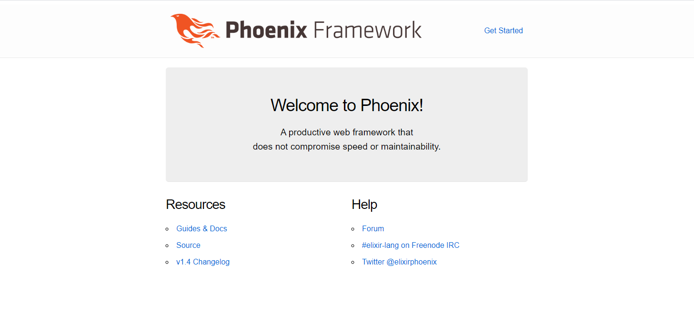
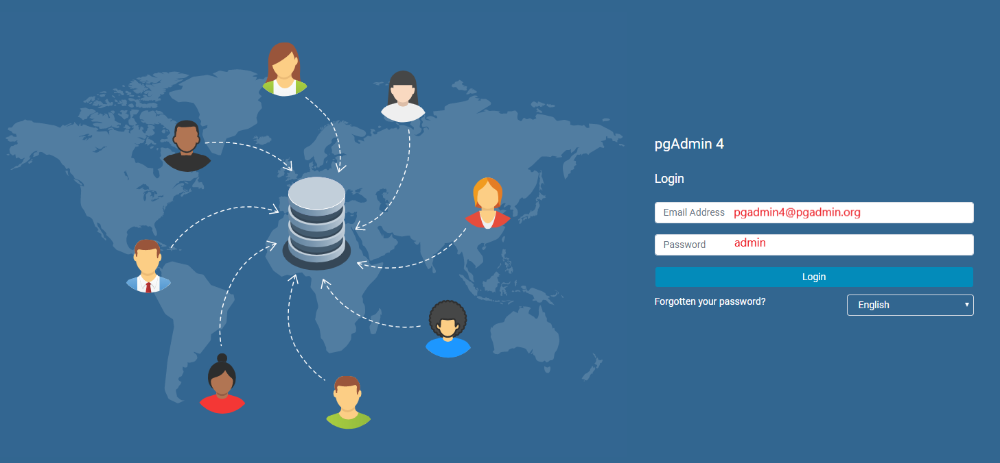

## Compose sample application
### Elixir application with Phoenix framework, a Postgres database and pgAdmin for DB management tool

Project structure:
```
.
├── example_app
│   ├── Dockerfile
│   ...
├── docker-compose.yaml
├── phoenix_output.png
├── pgadmin_output.png
└── README.md
```

[_docker-compose.yaml_](docker-compose.yaml)
```
services:
  example_app:
    build: example_app
    environment:
      ...
  db:
    image: postgres
    ports: 
      - "5432:5432" 
    environment: 
      ...
  pgadmin:
    image: dpage/pgadmin4 
    ports: 
      - "5050:80" 
    ...
```
The compose file defines an application with three services `example_app`, `db` and `pgadmin`.
When deploying the application, docker-compose maps port 80 of the pgadmin container to port 5050 of the host and the port 4000 of the example_app container to port 4000 of the host as specified in the file.
Make sure ports 4000 and 5050 on the host are not already being in use.

## Deploy with docker-compose

```
$ docker-compose up -d
Creating network "phoenix-postgres-pgadmin_default" with the default driver
Creating volume "phoenix-postgres-pgadmin_pgadmin" with default driver
Creating volume "phoenix-postgres-pgadmin_postgres" with default driver
Pulling pgadmin (dpage/pgadmin4:)...
latest: Pulling from dpage/pgadmin4
...
Successfully built faa13730018d
Successfully tagged phoenix-postgres-pgadmin_example_app:latest
Image for service example_app was built because it did not already exist. To rebuild this image you must use `docker-compose build` or `docker-compose up --build`.
Creating phoenix-postgres-pgadmin_pgadmin_1 ... done
Creating phoenix-postgres-pgadmin_db_1      ... done
Creating phoenix-postgres-pgadmin_example_app_1     ... done
```

## Expected result

Listing containers must show two containers running and the port mapping as below:
```
$ docker ps
CONTAINER ID        IMAGE                          COMMAND                  CREATED             STATUS              PORTS                           NAMES
a12ab4dc42fb        phoenix-postgres-pgadmin_example_app   "sh entrypoint.sh"       22 seconds ago      Up 20 seconds       0.0.0.0:4000->4000/tcp          phoenix-postgres-pgadmin_app_1
39c7a3212d51        postgres                       "docker-entrypoint.s…"   23 seconds ago      Up 21 seconds       5432/tcp                        phoenix-postgres-pgadmin_db_1
1cea47b5d620        dpage/pgadmin4                 "/entrypoint.sh"         23 seconds ago      Up 22 seconds       443/tcp, 0.0.0.0:5050->80/tcp   phoenix-postgres-pgadmin_pgadmin_1
```

After the application starts, navigate to `http://localhost:4000` and `http://localhost:5050` in your web browser:





Stop and remove the containers
```
$ docker-compose down
Stopping phoenix-postgres-pgadmin_example_app_1     ... done
Stopping phoenix-postgres-pgadmin_db_1      ... done
Stopping phoenix-postgres-pgadmin_pgadmin_1 ... done
Removing network phoenix-postgres-pgadmin_default
```