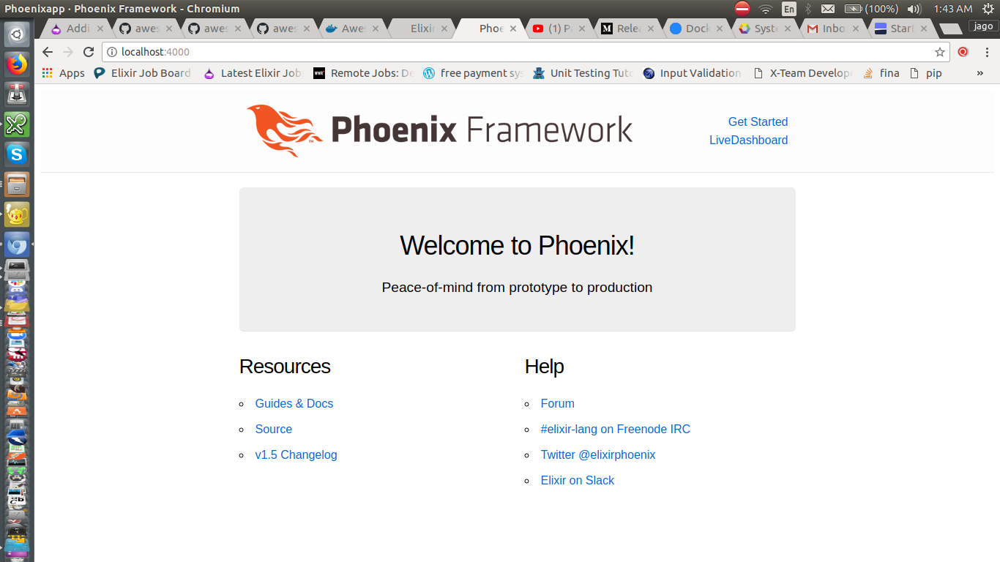

## Compose sample application
### Elixir application with Phoenix framework and  a Postgres database

Project structure:
```
.
├── app
│   ├── phoenixapp
│       ├───....
├── db
│   ├── db_env
├── docker-compose.yml
└── README.md
```

[docker-compose.yml](docker-compose.yml)
```
version: "3"
services:
  db:
    image: postgres:alpine
    env_file: db/db_env
    restart: always
  backend:
    build: app/
    restart: always
    command: mix phx.server
    env_file: db/db_env
    ports:
      - 4000:4000
    stdin_open: true
    tty: true
    depends_on:
      - db
    ...
```
The compose file defines an application with two services  `db` and `backend`.

running the dockerfile does some magic with docker :) and then creates a new phoenix app running at port 4000

## Deploy with docker-compose

```
$ docker-compose up -d
Building backend
Step 1/8 : FROM elixir:latest
...
Successfully built 016ca9fec348
Successfully tagged phoenixpostgres_backend:latest
Creating phoenixpostgres_db_1 ... 
Creating phoenixpostgres_db_1 ... done
Creating phoenixpostgres_backend_1 ... 
Creating phoenixpostgres_backend_1 ... done

```

## Expected result

Listing containers must show two containers running and the port mapping as below:
```
$ docker-compose ps
          Name                         Command              State           Ports          
------------------------------------------------------------------------------------------
phoenixpostgres_backend_1   mix phx.server                  Up      0.0.0.0:4000->4000/tcp 
phoenixpostgres_db_1        docker-entrypoint.sh postgres   Up      5432/tcp 
```

After the application starts, navigate to `http://localhost:4000` in your web browser:




Stop and remove the containers
```
$ docker-compose down -v
Stopping phoenixpostgres_backend_1 ... done
Stopping phoenixpostgres_db_1      ... done
Removing phoenixpostgres_backend_1 ... done
Removing phoenixpostgres_db_1      ... done
Removing network phoenixpostgres_default

```
